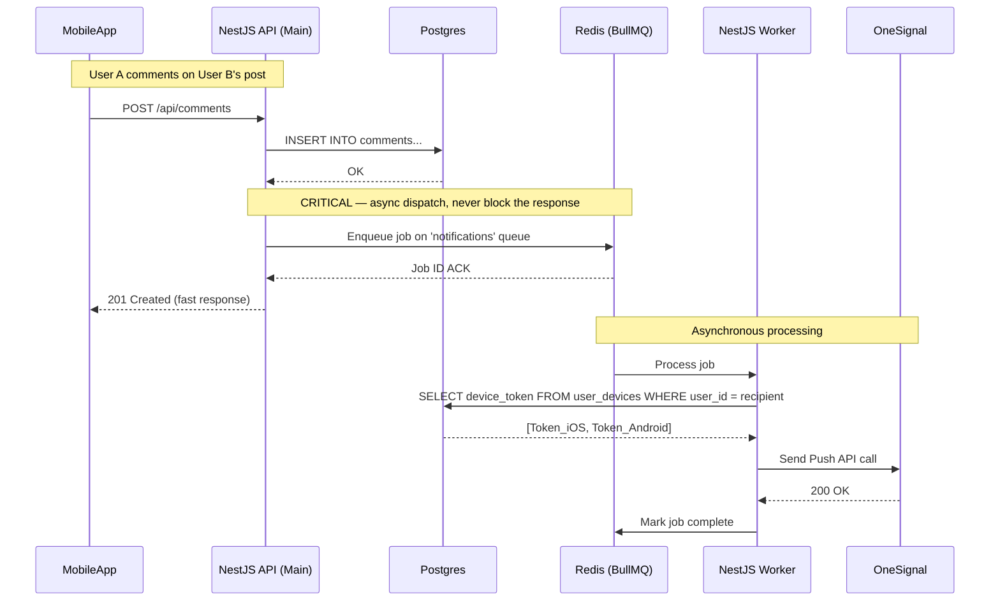
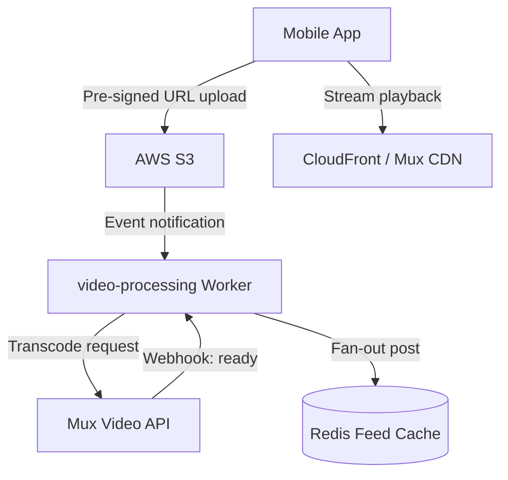

# Scalable SaaS Backend Architecture: Church Management Platform & Global Social Network

**Execution Timeline: 3 Months (12 Weeks)**

This document outlines the production-ready backend architecture and execution roadmap for a highly scalable, multi-tenant church management platform with integrated global social features.

This is a directive for immediate engineering execution, prioritizing a robust security foundation and scalable asynchronous patterns to meet the aggressive 3-month deadline without incurring massive technical debt.

---

## 1. Architectural Strategy

We will execute a **Hybrid Strategy** that leverages best-in-class managed services for undifferentiated heavy lifting (database hosting, auth, video) while building a custom, high-performance backend for core business logic.

### Core Components

| Component | Technology | Role |
| :--- | :--- | :--- |
| **Primary Database & Auth** | Supabase (PostgreSQL) | Managed Postgres, identity management, RLS primitives |
| **Backend API & Workers** | Node.js (NestJS) | Modular monolith — REST + GraphQL endpoints + async workers |
| **Async Job Queue** | BullMQ + Redis | Social fan-out, video webhooks, push notifications |
| **Media Pipeline** | AWS S3 + Mux | S3 for raw storage, Mux for HLS transcoding and streaming |
| **Payments** | Stripe Connect | Multi-party giving flows — platform fee + church payout |

---

## 2. The 12-Week Execution Roadmap

> [!IMPORTANT]
> This timeline is rigid. Slippage in Phase 1 will jeopardize the entire delivery.

### Phase 1: The Iron Foundation & Security Core (Weeks 1–3)

**Goal:** A deployed, secure backend where multi-tenancy is mathematically guaranteed by the database.

- **W1:** Finalize PostgreSQL schema. Implement the Auth Sync trigger. Write and test RLS policies for all tenant-scoped tables.
- **W2:** Initialize NestJS monolith skeleton. Set up CI/CD pipeline. Integrate Sentry and OpenTelemetry from Day 1.
- **W3:** Implement core REST CRUD (Tenants, Users, Memberships). Set up Redis and BullMQ infrastructure with DLQ configuration.

### Phase 2: The Social Engine & Media Pipeline (Weeks 4–6)

**Goal:** Users can create rich-media posts, see feeds, and interact.

- **W4:** Implement S3 pre-signed URL upload flow and Mux webhook handlers for video processing.
- **W5:** Develop the dual-feed system — standard SQL + RLS for church feeds; Redis-backed fan-out via BullMQ for the global feed. Implement GraphQL for the feed layer.
- **W6:** Integrate Supabase Realtime for chat. Implement the Push Notification BullMQ worker and OneSignal integration.

### Phase 3: Church Management & Monetization (Weeks 7–9)

**Goal:** The B2B side — giving, member management, and search.

- **W7:** Build admin APIs for member roles. Implement full-text search using Postgres `tsvector`.
- **W8:** Implement Stripe Connect onboarding and the split-payment giving flow.
- **W9:** Frontend integration and edge case handling for multi-tenant context switching.

### Phase 4: Hardening & Launch Prep (Weeks 10–12)

**Goal:** A stable, compliant, production-ready platform.

- **W10:** Implement API Gateway rate-limiting via Redis. Conduct internal security audits (attempt to break RLS).
- **W11:** Implement GDPR compliance flows (right-to-erasure cascading deletes, data export endpoint).
- **W12:** Load testing, final bug fixes, and V1 launch.

---

## 3. Critical Technical Decisions & Specifications

> [!IMPORTANT]
> These specifications are frozen and ready for immediate implementation.

---

### Decision 1: Auth & Multi-Tenant RLS Architecture

**Problem:** Supabase Auth handles identity (who you are) but has no concept of tenancy (which church you belong to). We must bridge this gap securely, including users who belong to multiple churches and need to switch active context.

---

#### 1a — The Schema Foundation

```sql
-- 1. Tenants Table (Churches)
CREATE TABLE public.tenants (
    id                UUID PRIMARY KEY DEFAULT uuid_generate_v4(),
    name              TEXT NOT NULL,
    stripe_account_id TEXT,
    created_at        TIMESTAMP WITH TIME ZONE DEFAULT NOW()
);

-- 2. Users Table (Links Supabase Auth ID to our system)
CREATE TABLE public.users (
    id                      UUID PRIMARY KEY REFERENCES auth.users ON DELETE CASCADE,
    email                   TEXT NOT NULL UNIQUE,
    -- CRITICAL: The tenant context the user is currently viewing
    last_accessed_tenant_id UUID REFERENCES public.tenants(id),
    created_at              TIMESTAMP WITH TIME ZONE DEFAULT NOW()
);

-- 3. Tenant Memberships (Many-to-Many — supports users in multiple churches)
CREATE TABLE public.tenant_memberships (
    user_id   UUID REFERENCES public.users(id) ON DELETE CASCADE,
    tenant_id UUID REFERENCES public.tenants(id) ON DELETE CASCADE,
    role      TEXT CHECK (role IN ('admin', 'pastor', 'member')),
    PRIMARY KEY (user_id, tenant_id)
);
```

---

#### 1b — The Auth Sync Trigger

This function automatically injects the user's current tenant context into their JWT session metadata whenever `last_accessed_tenant_id` changes.

```sql
CREATE OR REPLACE FUNCTION public.handle_tenant_context_switch()
RETURNS TRIGGER AS $$
BEGIN
  UPDATE auth.users
  SET raw_app_meta_data =
    jsonb_set(
      COALESCE(raw_app_meta_data, '{}'::jsonb),
      '{current_tenant_id}',
      to_jsonb(NEW.last_accessed_tenant_id)
    )
  WHERE id = NEW.id;
  RETURN NEW;
END;
$$ LANGUAGE plpgsql SECURITY DEFINER;

-- Guard clause prevents spurious updates when value hasn't changed
CREATE TRIGGER on_tenant_switch
  AFTER UPDATE OF last_accessed_tenant_id ON public.users
  FOR EACH ROW
  WHEN (OLD.last_accessed_tenant_id IS DISTINCT FROM NEW.last_accessed_tenant_id)
  EXECUTE FUNCTION public.handle_tenant_context_switch();
```

---

#### 1c — The RLS Policy Syntax

> [!CAUTION]
> **Crucial implementation detail:** `current_tenant_id` is nested inside the `app_metadata` JSONB object in the JWT. You must use `->` first (returns JSONB), then `->>` (extracts text). Using a single `->>` on the top-level JWT will silently return `NULL` and your RLS policy will block all data. Test every policy with `SET request.jwt.claims` in `psql` before merging.

```sql
-- Apply this pattern to: posts, messages, transactions, tenant_memberships, etc.
CREATE POLICY "Tenant isolation for posts" ON public.posts
FOR ALL
USING (
  tenant_id = (auth.jwt() -> 'app_metadata' ->> 'current_tenant_id')::uuid
);
```

**Why this wins:** Security is enforced at the database kernel level. A developer writing `SELECT * FROM posts` with no filter will only receive rows for the authenticated user's current tenant. The data leak cannot happen.

---

### Decision 2: Backend Language & Job Queue System

**Problem:** We need a high-performance, event-driven backend to handle social features and background processing within a 3-month timeline.

**Decision: Node.js (NestJS) + BullMQ (Redis)**

| Feature | Node.js (NestJS) + BullMQ | Python (FastAPI) + Celery | Verdict |
| :--- | :--- | :--- | :--- |
| **I/O Concurrency** | Excellent (non-blocking event loop) | Good (asyncio) | Node wins for high-throughput social events |
| **Real-time Ecosystem** | Superior (WebSockets, Socket.io native) | Requires separate services | Node is the natural home for chat and feeds |
| **Setup Complexity** | Low (BullMQ is lighter) | Higher (Celery config is heavy) | BullMQ fits the 3-month timeline better |
| **Full-stack Consistency** | Unified TypeScript with frontend | Context switch for frontend devs | NestJS reduces cognitive load under deadline |

---

#### 2a — Queue Definitions & Priorities

Initialize NestJS with `@nestjs/bullmq`. Define three distinct queues from day one:

| Queue | Priority | Purpose |
| :--- | :--- | :--- |
| `social-fanout` | High | Distribute new posts to followers' Redis feed lists |
| `notifications` | High | Send push alerts for comments, mentions, follows |
| `video-processing` | Medium | Handle Mux webhook events, update post status |

---

#### 2b — Dead-Letter Queue (DLQ) Configuration — Day 1 Requirement

Every queue must be configured with retry logic and a DLQ. Silent job failures in production are catastrophic for user trust.

```typescript
// app.module.ts — global BullMQ defaults
BullModule.forRoot({
  connection: {
    host: process.env.REDIS_HOST,
    port: parseInt(process.env.REDIS_PORT),
  },
  defaultJobOptions: {
    attempts: 3,              // Retry failed jobs 3 times
    backoff: {
      type: 'exponential',
      delay: 1000,            // 1s → 2s → 4s
    },
    removeOnComplete: true,
    removeOnFail: false,      // CRITICAL: preserve failed jobs for inspection
  },
})
```

Mount Bull Board at `/admin/queues` (behind admin auth) on day one. Without this, there is no visibility into a stalled `notifications` queue or a broken Mux webhook.

---

### Decision 3: Async Push Notification Architecture

**Problem:** We need a reliable, non-blocking way to send mobile push notifications across iOS, Android, and web.

**Decision: Async Aggregator Pattern — BullMQ `notifications` queue → Worker → OneSignal**

Push is **never** dispatched inline from the main API request handler. It is always enqueued as a background job. This isolates the main API from third-party latency and outages.

---

#### 3a — The Schema

```sql
CREATE TABLE public.user_devices (
    id             UUID PRIMARY KEY DEFAULT uuid_generate_v4(),
    user_id        UUID REFERENCES public.users(id) ON DELETE CASCADE,
    device_token   TEXT NOT NULL,
    platform       TEXT CHECK (platform IN ('ios', 'android', 'web')),
    last_active_at TIMESTAMP WITH TIME ZONE DEFAULT NOW(),
    UNIQUE(user_id, device_token)  -- One token per device per user
);
```

**Registration endpoint:** `POST /api/users/device-token { token: string, platform: "ios" | "android" | "web" }`

---

#### 3b — The Async Dispatch Flow



---

#### 3c — The Job Contract (Shared TypeScript Interface)

This is the interface between the Main API (producer) and the Notification Worker (consumer). Define it in a shared library so both sides are bound to the same shape at compile time.

```typescript
// libs/shared/src/interfaces/notification-job.interface.ts
export interface NotificationJobData {
  type: 'NEW_COMMENT' | 'NEW_FOLLOWER' | 'POST_LIKED' | 'MENTION';
  recipientUserId: string;  // UUID of the user receiving the push
  payload: {
    actorName: string;      // e.g., "John Doe"
    entityId: string;       // e.g., Post UUID or Comment UUID
    previewText?: string;   // e.g., "commented: 'Amen to that!'"
  };
}
```

**Why OneSignal over direct FCM/APNs:** OneSignal manages device token lifecycle (rotation, expiry, deregistration) across platforms from a single API call and provides a delivery analytics dashboard. If OneSignal is replaced at scale, only the Worker changes. The Main API, schema, and queue contract are untouched.

---

### Summary of Immediate Actions (Day 1 Checklist)

| Team | Action Item | Deliverable |
| :--- | :--- | :--- |
| **Database** | Implement `tenants`, `users`, `tenant_memberships` tables | Applied schema migration |
| **Database** | Implement `handle_tenant_context_switch` trigger function | Active trigger in DB |
| **Database** | Write and apply RLS policies using the `auth.jwt() -> 'app_metadata'` syntax | Verified RLS policies |
| **Backend** | Initialize NestJS project with `@nestjs/bullmq` and `ioredis` | Working project skeleton |
| **Backend** | Configure Redis connection and define 3 queues with DLQ options | `app.module.ts` config |
| **Mobile / API** | Define OpenAPI contract for `POST /api/auth/switch-tenant` | Swagger spec |
| **Mobile / API** | Define OpenAPI contract for `POST /api/users/device-token` | Swagger spec |

---

## 4. System Design Breakdown

### A. Church Isolation (CRITICAL)

Security is enforced at the database kernel level using PostgreSQL RLS. Application-level checks are insufficient and prone to developer error. The RLS policy relies entirely on the correct JWT metadata being present (see Section 3 — Decision 1).

```sql
-- Finalized RLS policy example
CREATE POLICY "Tenant isolation for members" ON public.tenant_memberships
FOR ALL
USING (
  tenant_id = (auth.jwt() -> 'app_metadata' ->> 'current_tenant_id')::uuid
);
```

### B. Global Feed + Reels Architecture

We employ a hybrid approach to feed generation:

- **Internal Church Feed:** Standard synchronous SQL query — results are already filtered by RLS.
- **Global Social Feed:** Asynchronous "Fan-Out on Write." When a global post is created, the BullMQ `social-fanout` worker appends the Post ID to the Redis feed lists of all followers.
- **Media Delivery:** The mobile app uploads directly to S3 via pre-signed URLs (bypassing the backend entirely). An S3 event triggers the BullMQ `video-processing` worker to call the Mux API for HLS transcoding. The backend never touches a raw video byte.



### C. Real-Time Chat & Community

Supabase Realtime (built on Elixir/Phoenix Channels) broadcasts database changes to subscribed clients over WebSockets. Messages are written to a `messages` table; the DB triggers a Realtime event that the client receives instantly.

**Scaling trigger:** When concurrent WebSocket connections exceed ~50k sustained, evaluate moving to dedicated Supabase Realtime instances or migrating to Stream (getstream.io).

### D. Giving / Payments Architecture

We use **Stripe Connect (Standard/Express)**. The platform acts as the orchestrator:

1. Each church completes Stripe Connect onboarding and receives a `stripe_account_id`.
2. When a user donates $100 to a church, we create a Destination Charge.
3. Stripe takes 2.9% + $0.30 processing fee. The platform takes a 1% application fee. The remainder routes directly to the church's connected bank account.
4. Our database stores only the `stripe_charge_id`. No sensitive card data ever touches our system.

---

## 5. Database Design (PostgreSQL)

```mermaid
erDiagram
    TENANTS {
        uuid id PK
        string name
        string stripe_account_id
    }
    USERS {
        uuid id PK "Links to auth.users"
        uuid last_accessed_tenant_id FK "Current context"
        string email
    }
    TENANT_MEMBERSHIPS {
        uuid user_id PK FK
        uuid tenant_id PK FK
        string role
    }
    USER_DEVICES {
        uuid id PK
        uuid user_id FK
        string device_token
        string platform
    }
    POSTS {
        uuid id PK
        uuid author_id FK
        uuid tenant_id FK "NULL if global post"
        string content
        string video_mux_playback_id
        timestamp created_at
    }
    TRANSACTIONS {
        uuid id PK
        uuid tenant_id FK
        uuid user_id FK
        decimal amount
        string stripe_charge_id
    }

    TENANTS ||--o{ TENANT_MEMBERSHIPS : "has"
    USERS ||--o{ TENANT_MEMBERSHIPS : "belongs to"
    USERS ||--o{ USER_DEVICES : "owns"
    USERS ||--o{ POSTS : "authors"
    TENANTS ||--o{ POSTS : "contains (isolated)"
    TENANTS ||--o{ TRANSACTIONS : "receives"
```

> [!TIP]
> **Partitioning Strategy:** `POSTS.tenant_id` is nullable by design. `NULL` = a Global Post, visible to the entire platform's feed engine. A UUID value = a church-internal post, hidden from all other tenants by RLS. The `TENANT_MEMBERSHIPS` table enables a single user account to belong to multiple churches with distinct roles in each.

---

## 6. Scaling Strategy

| Phase | User Scale | Key Actions |
| :--- | :--- | :--- |
| **Phase 1 (Launch)** | 1k–10k users | Single NestJS monolith on Render/AWS App Runner. Managed Supabase. Synchronous DB queries for church feeds. |
| **Phase 2 (Growth)** | 100k users | Redis for global feed caching. Mandatory PgBouncer connection pooling. Aggressive CDN usage for all media. Supabase read replicas. |
| **Phase 3 (Scale)** | 1M+ users | Migrate PKs to sortable IDs (ULID/Snowflake) to prevent index fragmentation. Shard DB by `tenant_id` (Citus/Aurora). Extract Social Feed into a dedicated Go/Rust microservice if Node becomes a bottleneck. |

---

## 7. Risks & Mistakes to Avoid

> [!CAUTION]

1. **Broken RLS context.** If the `last_accessed_tenant_id` trigger fails to fire or the JWT metadata isn't synced correctly, users will see an empty dashboard with no error. This code path requires 100% integration test coverage — test with real Postgres + real JWTs, not mocks.

2. **Synchronous heavy lifting.** Never perform video processing, social fan-out, or third-party API calls (push notifications, Stripe webhooks) in the main HTTP request thread. Always offload to BullMQ. A single slow job will block the Node.js event loop.

3. **Ignoring Dead-Letter Queues.** If background jobs fail silently without a DLQ and monitoring on Bull Board, critical features (push notifications, video processing) will stop working without any alert. DLQ configuration is a Day 1 requirement, not a later improvement.
